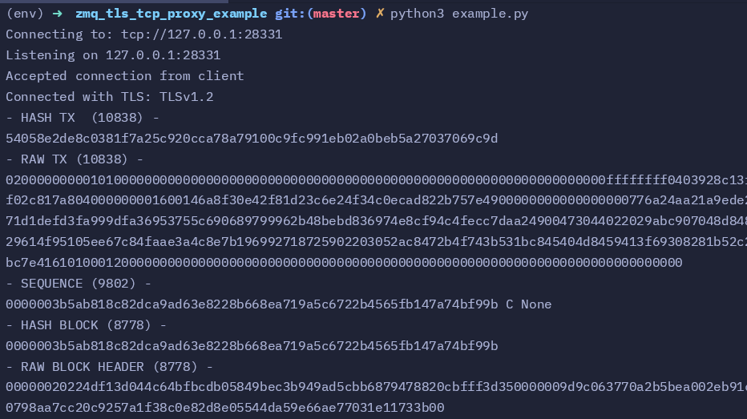

# Bitcoind ZMQ data over TLS wrapped TCP stream
Simple python example showing how to create a proxy to forward zmq data over a local TCP stream to a TLS wrapped TCP stream connected to a remote server. Using bitcoin core as the application emitting zmq data.

### How to use:

1) Create a python virutal environment
```
python3 -m venv env
```

2) Activate the virtual environment
```
source env/bin/activate
```

3) Install dependecies:
```
pip3 install -r requirements.txt
```

4) Update the hostname and port in the main section to be what the remote bitcoind expects:
```
hostname = "" #remote host name, ex. 'bcntplorcd.b.voltageapp.io'
port = 28332 #default zmq port for bitcoind
```

5) Run the script:
```
python3 example.py
```

6) should see similar output:


